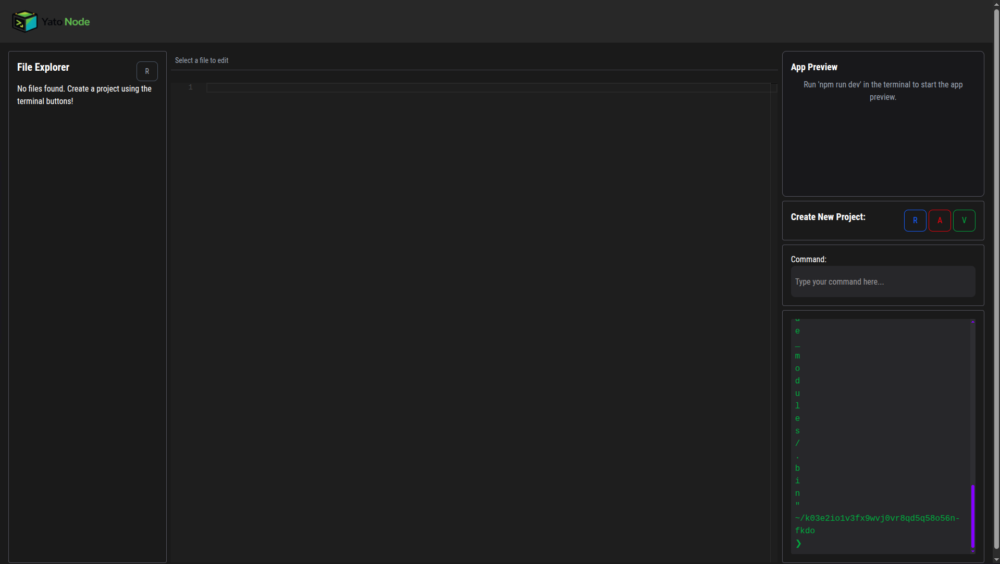

# Yato React ☁️⚡

A powerful, cloud-based online code editor built to run Node.js frameworks directly in the browser. Yato React provides a VS Code-like experience for building React, Angular, and Vue.js applications without any local setup.

## 🚀 Overview

Yato React removes the friction of setting up local development environments. It offers a fully functional web-based IDE where users can create projects, write code with intelligent syntax highlighting, and see their changes instantly in a live preview window.

## ✨ Key Features

-   **Multi-Framework Support:** One-click project generation for **React**, **Angular**, and **Vue.js**.
-   **Monaco Editor Integration:** Powered by the same editor engine as VS Code, providing syntax highlighting, intellisense, and code formatting.
-   **Live App Preview:** Real-time rendering of the user's code in an embedded preview pane.
-   **Integrated Terminal:** A built-in web terminal to execute commands and view build logs.
-   **File Explorer:** Intuitive file tree for managing project structure and switching between files.

## 🛠️ Tech Stack

-   **Frontend:** React.js
-   **Styling:** Tailwind CSS (for the dark-mode UI)
-   **Editor Engine:** Monaco Editor
-   **Runtime:** Node.js (Cloud/Containerized Environment)

## 📸 Interface


*(The main editor interface featuring the file explorer, code editor, and live preview)*

## 📦 Getting Started

To run the frontend of the editor locally:

1.  **Clone the repository**
    ```bash
    git clone [https://github.com/abhi-afk-dev/yato_react.git](https://github.com/abhi-afk-dev/yato_react.git)
    ```

2.  **Navigate to the project directory**
    ```bash
    cd frontend
    ```

3.  **Install dependencies**
    ```bash
    npm install
    ```

4.  **Start the development server**
    ```bash
    npm run dev
    ```

## 📄 License

This project is open source and available under the [MIT License](LICENSE).